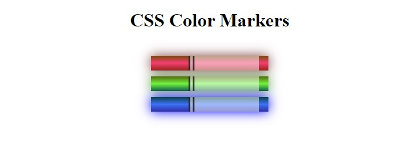

# CSS Color Markers

Selecting the correct colors for webpage can greatly improve the aesthetic appeal to readers.

## Description

In this [FreeCodeCamp](https://www.freecodecamp.org/learn/2022/responsive-web-design/#learn-css-colors-by-building-a-set-of-colored-markers) module, I have built a set of colored markers. I learnt different ways to set color values and how to pair colors with each other.

## Sample Page
Demo : [Link](https://css-color-markers.priyam19.repl.co)

## Image
