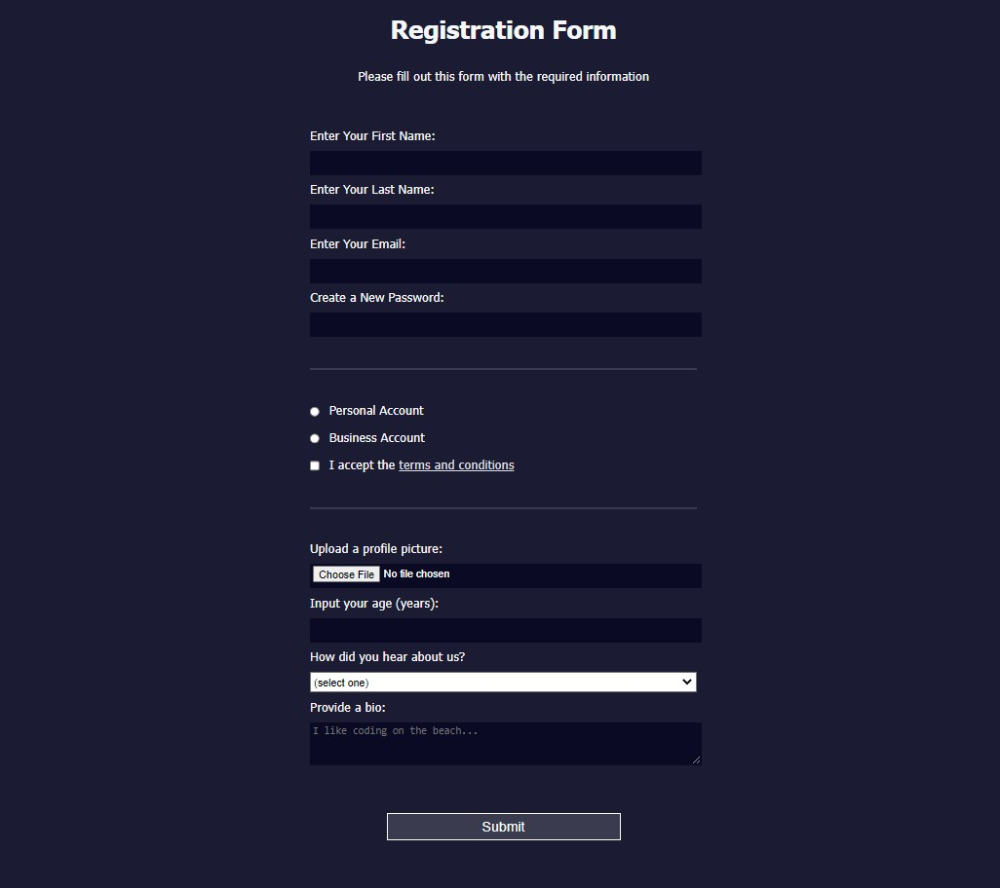

# Registration Form

Use of HTML forms to collect information from people who visit the webpage. 

## Description

In this [FreeCodeCamp](https://www.freecodecamp.org/learn/2022/responsive-web-design/#learn-html-forms-by-building-a-registration-form) module, I have used HTML forms by building a signup page.

## Sample Page
Demo : [Link](https://registration-form.priyam19.repl.co/)

## Image
